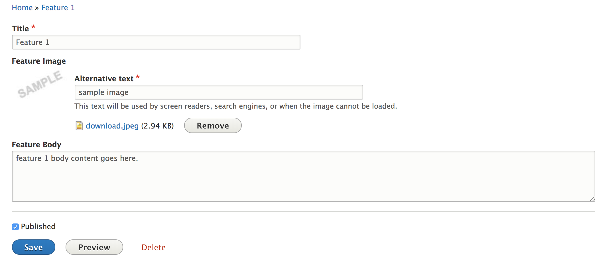
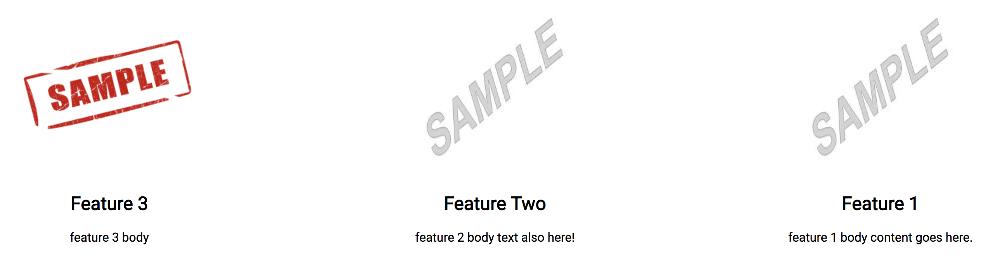

# Sample Application: Headless Drupal 8 with React Frontend

This project was built to demonstrate a headless instance of Drupal 8 to control the backend, using React to render the information on the frontend.

Users can create a new feature, as well as edit the feature image, feature title, and feature body within the Drupal 8 backend integration. The data is accessed by the React frontend via Rest API Export (using a Drupal View) and passed through a Features component to individual Feature components to be rendered.

 

Data live-reloads from the D8 integration every 30 seconds.

I created the Drupal 8 instance locally using [Docksal](https://github.com/docksal/docksal) and the React instance using [create-react-app](https://github.com/facebook/create-react-app).

---
The frontend can be viewed live http://dev1.redcrestdevelopment.com/ which pulls data from http://dev2.redcrestdevelopment.com/
---

To run project locally:

1. Navigate to the `d8-sample-backend` folder and start Drupal vm environment

   `fin vm start`

2. Navigate to the `d8-sample-react` folder and start React environment

   `yarn start`

>**Note** I'm still working on cleaning this up so it can be easier to understand and use.

